# Authentication Portal - Quarkus Backend

A production-ready identity management service built with modern cloud-native standards. This project provides a standalone authentication microservice designed to handle user lifecycles securely and efficiently at scale.

Key Features

    Secure Onboarding: Full user signup flow with mandatory email verification tokens.

    Stateless Authentication: JSON Web Token (JWT) implementation for scalable, session-less authorization.

    Cloud Deployment: Fully containerized and deployed on AWS infrastructure for high availability.

    Security Best Practices: Implements salted password hashing, rate limiting, and CORS configuration.


## 📋 Features

✅ **User Registration** - Secure signup with email and password  
✅ **Password Encryption** - BCrypt salted password hashing  
✅ **Email Verification** - Automated email verification with unique tokens  
✅ **User Authentication** - Session-based login/logout system  
✅ **Dashboard Access Control** - Different views based on email verification status  
✅ **Modern UI/UX** - Clean, responsive React interface  
✅ **Microservices Architecture** - Scalable containerized services  
✅ **AWS Deployment** - Production-ready cloud hosting  

## 🏗️ Architecture Overview

```mermaid
graph TB
    User[👤 User Browser] --> Nginx[🌐 Nginx Proxy]

    Nginx --> Frontend[⚛️ React Frontend]
    Nginx --> SessionAPI[📡 /api/* → Session Server]

    Frontend --> SessionServer[🖥️ Session Server<br/>Node.js + Express]
    SessionServer --> AuthService[🔐 Auth Service<br/>Quarkus + Java]
    SessionServer --> EmailService[📧 Email Service<br/>Python + FastAPI]

    AuthService --> PostgreSQL[(🗄️ PostgreSQL<br/>Database)]
    EmailService --> Brevo[📮 Brevo API<br/>Email Delivery]

    subgraph "🐳 Docker Containers"
        Frontend
        SessionServer
        AuthService
        EmailService
        PostgreSQL
        Nginx
    end

    subgraph "☁️ AWS EC2"
        direction TB
        Docker[Docker Compose]
    end

    %% Color Styling
    style User fill:#E3F2FD,stroke:#1E88E5,stroke-width:2px
    style Nginx fill:#E1F5FE,stroke:#0288D1,stroke-width:2px
    style Frontend fill:#E8F5E9,stroke:#2E7D32,stroke-width:2px
    style SessionServer fill:#FFFDE7,stroke:#F9A825,stroke-width:2px
    style AuthService fill:#FCE4EC,stroke:#C2185B,stroke-width:2px
    style EmailService fill:#F3E5F5,stroke:#6A1B9A,stroke-width:2px
    style PostgreSQL fill:#E0F2F1,stroke:#00796B,stroke-width:2px
    style Brevo fill:#ECEFF1,stroke:#455A64,stroke-width:2px
```



**Portal URL**: [http://18.61.252.148](http://18.61.252.148)

## 🛠️ Tech Stack

### **Backend Services**
- **🔥 Quarkus** - High-performance Java framework
- **🐍 Python FastAPI** - Email service microservice
- **🟢 Node.js + Express** - Session management middleware
- **☕ Java 21** - Latest LTS version
- **🔧 Maven** - Build automation and dependency management

### **Frontend**
- **⚛️ React 18** - Modern UI library
- **🎨 CSS3** - Custom styling with glass morphism design
- **📱 Responsive Design** - Mobile-first approach


### **Database & Storage**
- **🐘 PostgreSQL 16** - Primary relational database
- **💾 Docker Volumes** - Persistent data storage

### **Third-Party Services**
- **📮 Brevo (SendinBlue)** - Transactional email delivery
- **☁️ AWS EC2** - Cloud hosting platform
- **🐳 Docker Hub** - Container registry

### **DevOps & Deployment**
- **🐳 Docker + Docker Compose** - Containerization
- **🌐 Nginx** - Reverse proxy and load balancer
- **🔒 SSL Ready** - HTTPS configuration prepared
- **📝 Centralized Logging** - JSON log format

## 📊 Service Architecture

| Service | Technology | Port | Purpose |
|---------|------------|------|---------|
| **Frontend** | React | - | User interface |
| **Session Server** | Node.js | 3001 | Session management & API gateway |
| **Auth Service** | Quarkus | 8080 | User authentication & business logic |
| **Email Service** | Python | 8000 | Email verification system |
| **Database** | PostgreSQL | 5432 | Data persistence |
| **Proxy** | Nginx | 80/443 | Load balancing & SSL termination |

## 🚀 Quick Start

### Prerequisites
- Docker & Docker Compose
- AWS Account (for deployment)
- Brevo API Key (for emails)

### Local Development

1. **Clone the repository**
```bash
git clone https://github.com/nuggetplum/auth-quarkus.git
cd quarkus-backend
```

2. **Configure environment**
```bash
cp .env.example .env
# Edit .env with your configuration
```

3. **Start services**
```bash
docker-compose up -d
```

4. **Access the application**
- Frontend: http://localhost

### AWS Deployment

1. **Launch EC2 Instance**
   - AMI: Ubuntu 22.04 LTS
   - Instance Type: t2.micro (free tier)
   - Security Groups: HTTP (80), HTTPS (443), SSH (22)

2. **Setup on EC2**
```bash
# SSH into instance
ssh -i your-key.pem ubuntu@your-ec2-ip

# Run setup script
curl -fsSL https://raw.githubusercontent.com/rishichirchi/quarkus-backend/main/deployment/scripts/setup-ec2.sh | bash

# Clone and deploy
git clone https://https://github.com/nuggetplum/auth-quarkus.git
cd quarkus-backend
cp .env.example .env
# Enter .env with congif valuea

```

## 🔧 Configuration

### Environment Variables

```bash
# Database Configuration
POSTGRES_DB=authdb
POSTGRES_USER=postgres
POSTGRES_PASSWORD=your-secure-password

# Email Service (Brevo)
BREVO_API_KEY=your-brevo-api-key
BREVO_SENDER_EMAIL=noreply@yourdomain.com
BREVO_SENDER_NAME=YourAppName

# Application URLs
FRONTEND_URL=https://yourdomain.com
BACKEND_URL=http://auth-service:8080
t
```

## Security Features

- **Password Hashing**: BCrypt with salt
- **Session Security**: HTTP-only cookies with CSRF protection
- **Input Validation**: Comprehensive data sanitization
- **CORS Configuration**: Secure cross-origin requests


## User Flow

1. **Registration** → User signs up with email/password
2. **Email Verification** → System sends verification email via Brevo
3. **Account Activation** → User clicks verification link
4. **Login** → User authenticates with credentials
5. **Dashboard Access** → Different views based on verification status
6. **Session Management** → Secure logout and session handling


## 📄 License

This project is licensed under the MIT License - see the [LICENSE](LICENSE) file for details.


## Acknowledgments

- **Quarkus Team** for the amazing framework
- **Brevo** for reliable email delivery service
- **Docker** for containerization platform
- **AWS** for cloud infrastructure
- **React Community** for the frontend ecosystem

---

<div align="center">
  


</div>


